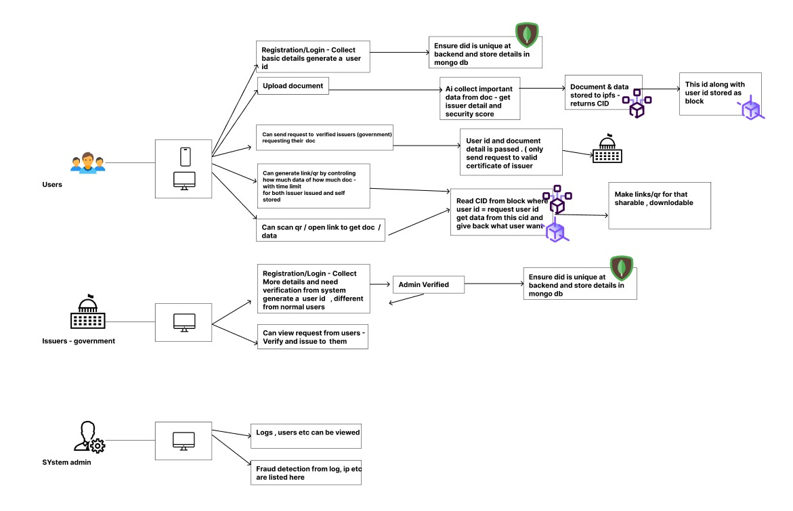

# SmrithiVault-frontend
Frontend for SmrithiVault 
This is the frontend UI built with **React.js**. It interacts with the Express.js backend via RESTful APIs.
Contribute to dev branch only

---


## SmrithiVault – Digital Identity & Document Verification

**Team OpenSmrithi**

SmrithiVault is a blockchain-based platform for secure digital identity and document verification.  
It addresses the inefficiencies of centralized identity systems and enables user-controlled data sharing.  
Documents are uploaded to IPFS, and their hashes are stored on the blockchain for tamper-proof integrity.  
Users can control what data verifiers see and generate offline-verifiable QR codes.  
AI extracts document content and detects fraud through anomaly detection techniques.  
Verifiers scan QR or DID to verify identity without needing full data exposure.  
The system aligns with Self-Sovereign Identity (SSI) principles and UN SDG 16.  
Built using React, Node.js, IPFS, Polygon, Solidity, and Python ML models.  
SmrithiVault ensures privacy, security, and accessibility—online or offline.


---
## Architecture

---
##  Getting Started

### 🔧 Prerequisites

- Node.js (v18+ recommended)
- npm or yarn

### 📦 Install Dependencies

```bash
clone the repository
cd smrithivault-frontend
npm install
```

###  Run the React App

```bash
npm start
```

App runs at: `http://localhost:3000`

Make sure backend server is also running at `http://localhost:5000`

---


---

## 🌐 Environment Variables

Create a `.env` file in `/frontend`:

```env
REACT_APP_API_URL=http://localhost:5000/api
```

Use in API requests like:
```js
fetch(`${process.env.REACT_APP_API_URL}/users`)
```

---


## 📝 Commit Message Convention

Follow this pattern:

```
<type>(scope): message

Types:
- feat: A new UI feature
- fix: Bug fix
- docs: Documentation only
- style: UI or CSS changes
- refactor: Code improvement without new features
- chore: Build/dependency updates
```

**Example:**
```
style(navbar): improve mobile responsiveness
```

---

## Common Scripts

| Script        | Description                     |
|---------------|---------------------------------|
| `npm start`   | Start React dev server          |
| `npm run build` | Create production build        |

---
